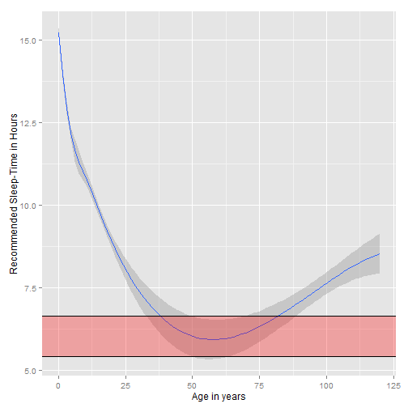

## Sleepy App
### by Manuel Kiewisch

    

--- ds:alert
### Do you routinely stay up too long, punching R code, studying online...?
.fragment Do you suffer from any or multiple of the following?
  

> - <b>General Tiredness</b>
> - <b>Red Eyes</b>
> - <b>Hallucination</b>
  

.fragment Then, this App is for **YOU**!

--- ds:blackout
### Sleepy App tells you how to sleep

The self-explanatory interface guides you trough the input panels, covering:
  

> - .grow Your Age
> - .grow Your usual sleep duration
> - .grow Your usual sleeping and waking times
  

In return, sleepy App calculates your sleep difference and optimal waking time!

--- ds:soothe &vertical
### The heart of sleepy App is the sleep-graph!
#### constructed from over one thousand sleep-samples in controlled experiments with happy sleepers
Here at the example of 50 years (<b>Arrow Down</b> for more)

 

*** &vertical
### Check out Sleepy App at
#### (www.sleepyApp.com)

If you have this nagging feeling that you don't get the most out of your sleep: Sleepy App will help you feel fitter!

 

</section>

